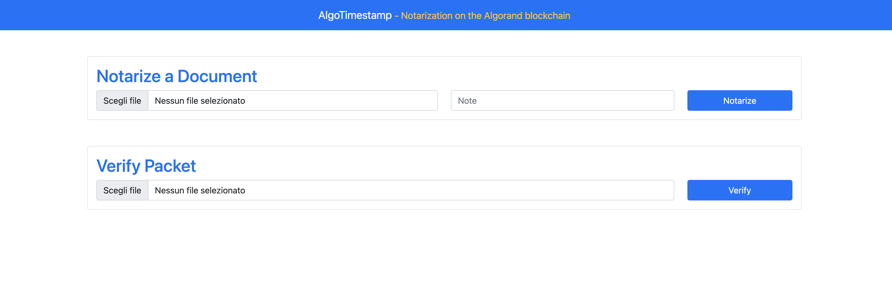
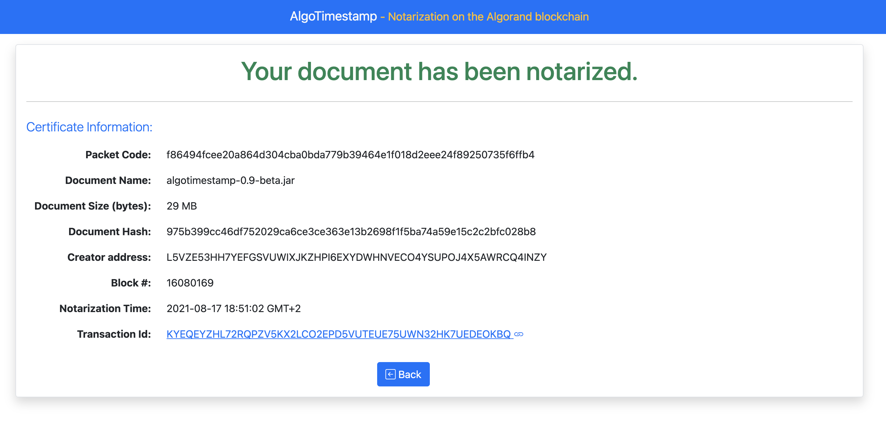
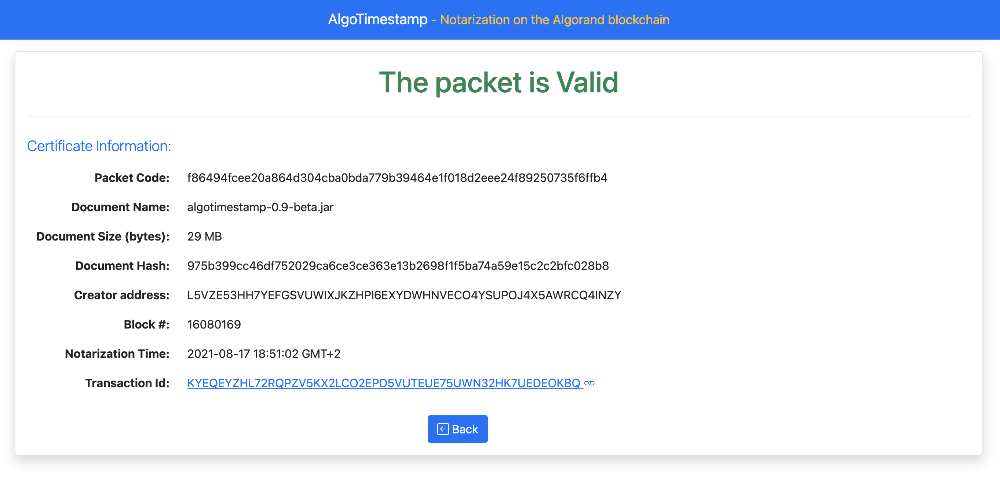

# Algo-timestamp
Algo-timestamp is a standalone java web application that allows you to notarize documents on the Algorand Blockchain. (For more details on the "Notarization" process, read the Whitepaper.md file)

You can run it on your own computer using the built-in user interface or (since it can be called via REST API) as-a-service.

In both cases, your sensitive information (such as you account address and passphrase or the document you want to notarize) never leaves your computer.
The only data sent over the Internet and stored in the blockchain are hash codes from which is not possibile to obtain the original source.

**IMPORTANT NOTE**: this software is not intended for production or legal use. It is distributed on an "AS IS" BASIS, WITHOUT WARRANTIES OR CONDITIONS OF ANY KIND, either express or implied.
See the License for the specific language governing permissions and limitations under the License.

## Download and run precompiled package
Go to [algo-timestamp github releases](https://github.com/david-ciamberlano/algo-timestamp/releases) (in the *"assets list"*) and download the latest *algotimestamp-dist.zip* package

Unzip the package. In the algotimestamp-dist folders there will be two files:
- algotimestamp-X.X.jar
- application.properties

The first one is the java application. The second one is a configuration file that you need to edit before starting the application (see below) 

**Note**: Alternatively, you can compile your own java from the source code. See the appendix to this document for more information

### Prerequisites
In order to run algo-timestamp you need java 11 or later (the latest release is here: https://jdk.java.net/16/).

you can check if you have correctly installed the java Runtime Environment (JRE) by typing in a shell:
```
java --version
```
You should get output similar to this (in this case java 15 is installed):
```
openjdk 15.0.2 2021-01-19
OpenJDK Runtime Environment (build 15.0.2+7-27)
OpenJDK 64-Bit Server VM (build 15.0.2+7-27, mixed mode, sharing)
```

### Configurations
Before running the algo-timestamp application, you have to edit the "application.properties" file.

1) you have to put your Algorand Wallet passfrase and its account address in the following properties (replace the text between the angle brackets <> as in the following example. It's important to not add spaces after the '=' character and at the end of the text):
```
algorand.account.passfrase=<replace-this-with-your-wallet-passfrase>
algorand.account.address=<replace-this-with-your-account-address>
```

```
EXAMPLE:
algorand.account.passfrase=alpha bravo charlie delta echo foxtrox golf [...]
algorand.account.address=ABCDEFGHI0123456789
```
NOTE: your passfrase and address are only stored locally and never leave your computer!
However, for extra security, it's recommended to use a newly created account with only a few Algos in it.

Notarize a document only cost 0.001 Algo (the standard transaction fee) so you can notarize thousands of documents by spending just a few Algos.

**Don't use your principal Algorand accounts**

If you have your personal node you can change the other properties (commented)... otherwise you can leave the default values. 

After changing the properties, you are ready to run the application.

## The user interface

To start Algo-timestamp, you can simply open a shell and type:

```
java -jar algotimestamp-X.X.jar
```

After a few seconds, the application will be ready and you can use it by opening the following URL in a browser: `http://localhost:8080`
The user interface is very simple: just two forms, one for Notarize a document, the other to verify a packet.



### Notarize a document
In the "Notarize a Document" form, you can select a document and optionally add a text note. The default max size for the file is set to 100Mb (but you can change this).
You can now click on the "Notarize" button to perform the registration on the blockchain.

After a few seconds the zip packet (with a long alphanumeric name) will be created on your hard drive, in the same folder of the jar application, and you will be redirected to a summary page that contain useful notarization information: 
- Packet Code: alphanumeric code (it's also the first part of the packet name)
- Document Name: the name of the document that was notarized
- Document Size: the size of the document
- Document Hash: the hash (sha256Hex) of the document. This info is also stored in the Blockchain
- Creator address: your wallet address
- Block #: the Algorand chain block containing the Notarization transaction
- Notarization Time: The timestamp of the notarization (obtained from the Block #)
- Transaction Id: the transaction ID. You can follow the link to check the transaction on the Algorand Blockchain



### Verify a packet
To verify a packet, just select it in the "Verify Packet" form and click on the "Verify" Button.
After a few seconds you will be redirected to a summary page that Validates (or rejects) the Notarization
The information shown is the same as we have after a succesfull notarization (see previous section).




## REST api
Algo-timestamp exposes two Rest endpoint:

- **api/notarize** -> to notarize a document
- **api/verify** -> to verify a document

### /api/notarize

This is an example of the syntax:
```
curl -X POST 'localhost:8080/api/notarize' --form 'file=@"path/to/document.ext"' --form 'note=your-optional-note' -O -J

--response

 % Total    % Received % Xferd  Average Speed   Time    Time     Time  Current
                                 Dload  Upload   Total   Spent    Left  Speed
100  2430  100  1167  100  1263    154    166  0:00:07  0:00:07 --:--:--   347
curl: Saved to filename '6218592d08235921f37af8c233e90c4227d74ed9eb832bd3a4e858cbbde0ba3b-1629305393.zip'
```

### /api/verify

```
curl -X POST 'localhost:8080/api/verify' --form 'file=@"6218592d08235921f37af8c233e90c4227d74ed9eb832bd3a4e858cbbde0ba3b-1629305393.zip"'  | jq

--response

  % Total    % Received % Xferd  Average Speed   Time    Time     Time  Current
                                 Dload  Upload   Total   Spent    Left  Speed
100  1965    0   527  100  1438   1178   3217 --:--:-- --:--:-- --:--:--  4395
{
  "blockchainData": {
    "appVersion": "0.9-beta",
    "packetCode": "6218592d08235921f37af8c233e90c4227d74ed9eb832bd3a4e858cbbde0ba3b",
    "documentHash": "479a136159383069a7d465fba0a7125172f6b79e9a7cefea1ed56a48e2659fc6",
    "note": "testnote"
  },
  "originalFileName": "application.properties",
  "docSize": 948,
  "creatorAddr": "L5VZE53HH7YEFGSVUWIXJKZHPI6EXYDWHNVECO4YSUPOJ4X5AWRCQ4INZY",
  "txId": "VYLYVBCWDMJPDJOEQHC6YQIY34XKP7XXSSKWHKV326ROWKL4MR7A",
  "blockNum": 16100505,
  "timestamp": 1629305388,
  "hrsize": "948 bytes",
  "formattedDate": "2021-08-18 18:49:48 GMT+2"
}
```

In case of error you will receive a HTTP 400 error (bad request).


## Appendix - compile the application from the source code

You will need maven and git installed.

You can clone the reporitory with the command:
```
git clone https://github.com/david-ciamberlano/algo-timestamp.git
```
then go into the algo-timestamp folder and execute the maven command:
```
mvn clean package
```
This command will compile the source code and build the artifact (algo-timestamp-x.x.jar in the "target" directory).
NOTE: remember to copy the application.properties as well. 
