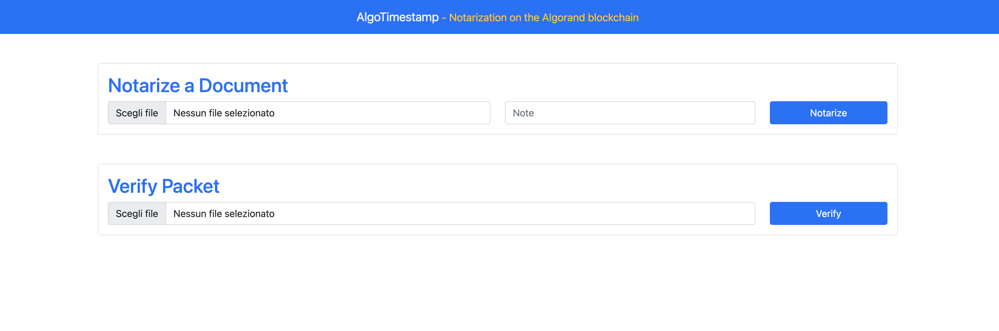

# algo-timestamp
*Notarization on Algorand Blockchain*

please refer to the [Documentation](Documentation) folder for more information.
- [How to use](Documentation/How-to-use.md)
- [Whitepaper](Documentation/Whitepaper.md)

---
**IMPORTANT NOTE**: this software is not intended for production or legal use. It is distributed on an "AS IS" BASIS, WITHOUT WARRANTIES OR CONDITIONS OF ANY KIND, either express or implied.
See the License for the specific language governing permissions and limitations under the License.

---

